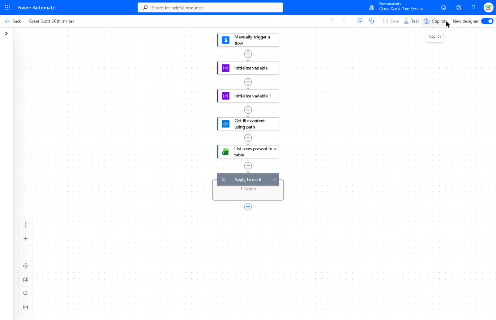
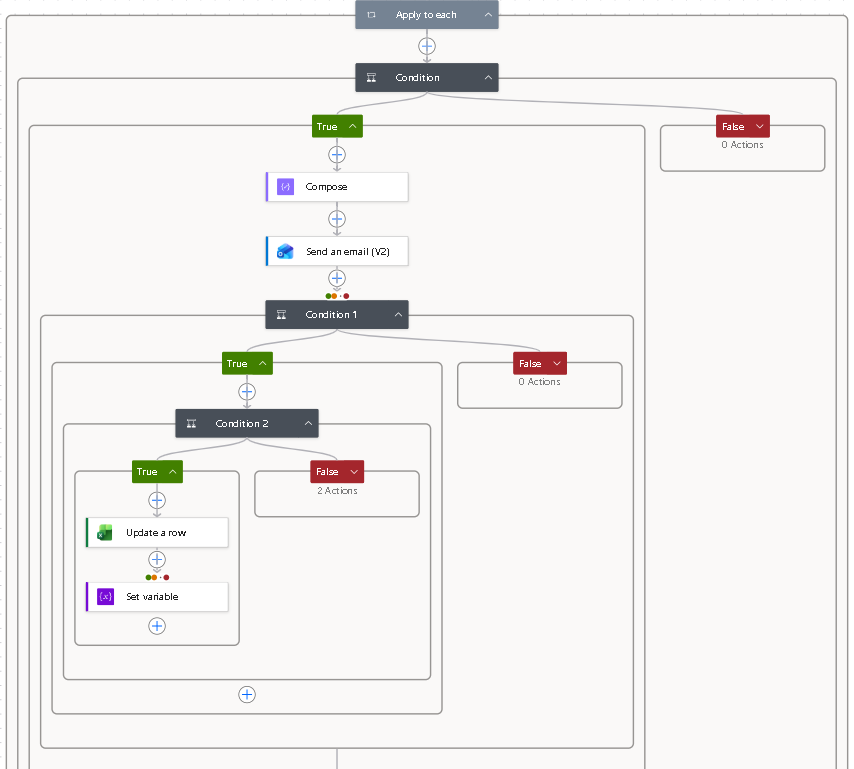
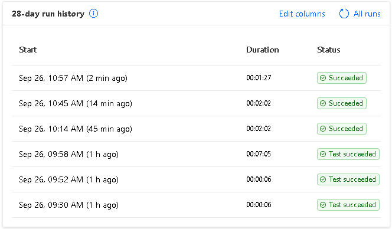
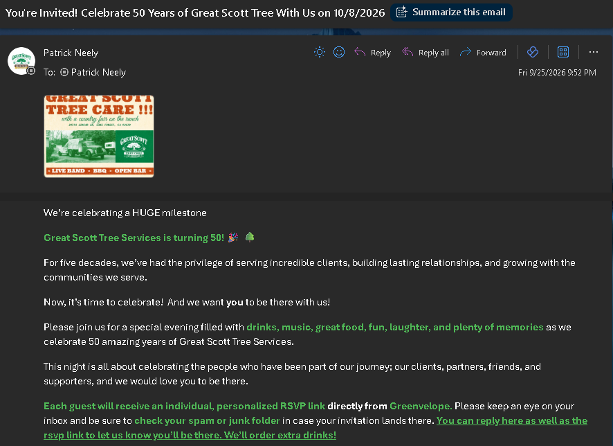
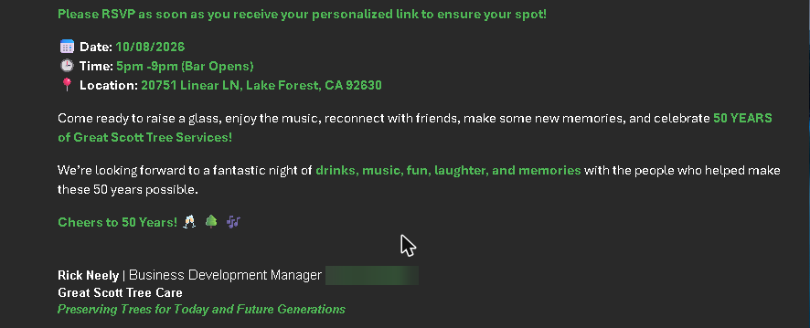

# 93 Individualized Invitations, One Send Each

A Power Automate flow that sent 93 personalized invitation emails from the client's own Microsoft 365 mailbox in a single evening — one recipient per email, each with their own RSVP link, zero duplicates and zero send failures.

Client: Great Scott Tree Care, a tree care company in Southern California, for their 50th anniversary event. Delivered under Everlance Virtual Services.

## The problem

93 guests each had a unique RSVP link generated by an event platform. Every email needed that guest's own link, their first name, and the event flyer attached. The client's wording had to go out word for word, unchanged. One recipient per email — no CC, no BCC. And it all had to go out the same evening.

A standard mail merge was not an option: the send had to come from the client's own work address, and each email carried a different per-guest link.

## Why the first build was thrown away

I built this first in Google Apps Script, sending through Gmail. It was built, tested and working.

The client then confirmed the emails had to send from their Microsoft 365 / Outlook address rather than Gmail. Apps Script cannot send as a Microsoft 365 mailbox. There was no patch for that — the sending identity *was* the requirement — so the working build was discarded and rebuilt in Power Automate.

Stated plainly, because it is the useful part: I should have pinned down which mailbox the emails would send from before writing any code. It is a five-minute question that cost a rebuild.

## How it works

- Manual trigger with a **TestMode** toggle
- Excel Online (Business) reads the guest table from OneDrive
- For each row, a Condition decides whether the row is eligible to send
- Compose builds the personalized body — first name, plus that guest's own RSVP link
- Office 365 Outlook **Send an email (V2)** sends one email, flyer attached from OneDrive
- `SENT` or `FAILED` plus a timestamp is written back to that guest's row
- A delay runs between sends

## Safeguards, and why each one exists

| Safeguard | What it prevents |
|---|---|
| Test mode — sends only to the client's own address, writes nothing to the sheet | Rehearsing on real guests |
| Rows already marked `SENT` are never re-sent | A repeated or resumed run emailing someone twice |
| Blank-email rows skipped | Wasted attempts and false `FAILED` marks |
| Halt after 3 consecutive failures | A broken connection quietly burning through the whole list |
| Delay between sends | Throttling and spam heuristics |
| Batches of 25, bounce check between batches | Discovering a bad list at email 93 instead of email 25 |

The common thread is that a sent email cannot be recalled. Every safeguard above exists because the mistake it prevents is not reversible.

## Verification

- Sent Items checked for duplicates
- Source columns hash-compared before and after the run, proving the guest data was not modified
- Bounces checked in Inbox, Junk and Deleted Items after every batch

## Result

93 emails in four batches, in about an hour. Zero send failures. Zero duplicates. Source data unchanged. Two bounces — both pre-existing bad addresses in the client's own list, identified and reported back to the client.

*The direct phone number in the signature is blurred. The company agreed to be named; an individual's direct line is a separate question.*

## What I would do differently

Confirm the sending mailbox before building anything — that one question was the whole cost of the first build.

I would also handle one gap in the write-back. The send happens first and the row is marked afterwards, which is the right order — marking first would flag a guest as `SENT` even if the send never happened, and that guest would simply never be invited. But it leaves a narrow case: the email goes out and the write to the sheet then fails, so the row still reads as unsent. Next time I would record that as its own state — sent, not recorded — so the gap is visible after the run instead of looking identical to a row that was never attempted.

And I would log each bounce check into the sheet rather than checking three mail folders by hand between batches.

---

**Repo name:** `power-automate-personalized-invites`

**One-line repo description:**
A Power Automate flow that sends individually personalized emails from a Microsoft 365 mailbox, with per-row send tracking, duplicate prevention, failure halts and post-send verification.
